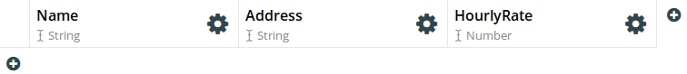
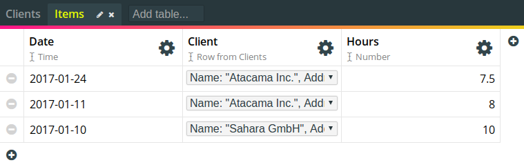
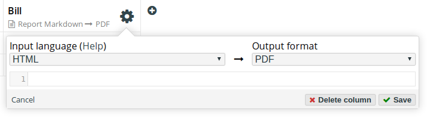

# Building Your First Herculus App

In this guide we are going to create a simple Herculus application. We will
assume that you are working as a freelancer and that you want to have a tool
that

* tracks how many hours you worked for which client, and
* allows you to create a PDF invoice that you can send to your clients at the
  end of the month.

By building such a tool with Herculus, you will learn how to

* organize your data into different tables,
* create relations between them,
* process your data to generate new data using formulas, and how to
* generate reports from your data.

## Create a new Project

After logging in, the first thing we are going to do is create a new project
(call it, for example, _Freelancing_).


Enter the name on the _Create new..._ card and press `Enter`. This will create
the project and bring you to the _Project_ page.

## The First Table

A project consists of several tables which are filled with your data. Since our
project was just created, there are no tables yet. Let's create one. Focus the
_Add table..._ input field, and enter the name:


Our first table will be the collection of clients that we work for, so we will
call it _Clients_. After you press enter, the newly created table will be
created and opened. Naturally, every table consists of _columns_ and _rows_. We
can add rows or columns by pressing the bottom left or top right plus icons,
respectively. In our case,

* each row will correspond to one of our clients
* each column will correspond to an attribute that a client has.

### Adding Columns

Let's first create a couple of columns for every attribute that we might
need. Press to top right plus icon and select _New data column_:


Don't worry about what a _report column_ is, we'll get to that later.

Every column has a _name_ and a _type_. The type is the kind of things that all
the cells in this column contain. For example, since all our clients have a
name, we'll give the first column the name _Name_, and since client names are
strings, we'll give the first column the type `String`.

The name of the column can be easily changed by clicking on the gray "Name..."
placeholder, entering the name and then pressing `Enter`. In order to change the
column's type, click on the gear symbol next to the column name:


The popup dialog shows two things: On the left, you can choose the
column type from a dropdown menu, and on the right, you can edit the formula
that is used to compute the data in this column (more on that later). So, choose
`String` from the dropdown menu, and click _Save_.

For our clients we want to have a second column for their address, which also
has the type `String`, and a third column, which will be the hourly rate that
you negotiated, of type `Number`. After you have added these columns, the table
should look like this:



### Adding Rows

After we've defined the two columns, it's time to add some clients to this
table. This is done by simply clicking on the lower left plus symbol (add
row). Once you have added a row, you can simply fill the cells by clicking
inside them and entering the strings. When done, just press `Enter`. After
adding two clients, the table might look like this:


## A Table for Billable Items

Now that we have a place to manage our clients, let's move to the next table. We
add a table called _Items_, which will be a list of billable items.

Each item that we might want to add to the list needs several attributes:

* The date of the item
* The client who will be billed for this
* How many hours you worked

Therefore, we add three columns to the items table:

* _Date_ of type `Time`
* _Client_ of type `Row from Clients`
* _Hours_ of type `Number`

The type `Row from Clients` is different from those we've seen so far, since it
refers to one of the tables in this project. It says that, for every cell in
this column, there needs to be a reference to a row from table _Clients_. If
you're familiar with relational databases like MySQL, this is would be something
like are foreign key to _Clients_. In order to configure this, choose `Row` as a
column type, and then `Clients` from the dropdown menu that appears below it,
like so:


After you've added all these columns, the table will look like this:


We can now fill the table with some dummy items. Values of type `Time` can be
conveniently entered using a datepicker. And _Client_ rows can be selected from
a dropdown menu. For example, you could enter the following data:



### The First Formula

This is a good time for adding the first piece of data processing to our tool,
by creating a column with a formula. Specifically, we may want to calculate the
amount billed for every item, which is the the rate that we negotiated with the
client of this item, multiplied by the number of hours we worked.

First, it's convenient to see how much will actually be billed for every item,
and second, we can use this amount for further data processing downstream when
we generate the bill.

In order to generate this data, we create a new column named _Amount_ with type
`Number`. Then, while the column config dialog is still open, we tick the _Use
formula_ checkbox, and enter the following formula:


Then click _Save_. There are two things to note:

* Since the data in this column is derived from a formula, it is not
  editable. You can recognize this fact by the small x-squared symbol next to
  the column's type.
* The data in this column will be always kept up to date when the data it
  depends on changes, like in a spreadsheet.

The formula we entered is relatively simple: We access the cells from the
_Client_ and _Hours_ columns with the `$` character. Since the value of a
_Client_ cell is a row from the _Clients_ table, we access the _HourlyRate_
column of that table with the dot `.` character. Again, if you're familiar with
relational databases, this would be done by a join, and if you're familiar with
spreadsheets, this would be done using the "vlookup" function.

If you want to read more about how to acces data from other columns and tables,
see
[Accessing Data From Other Cells](../../formulas/#accessing-data-from-other-cells-tables-columns).

## The Bills Table

We are now prepared for the final table that will put everything
together. Imagine it's the end of the month and you want to send out your
bills. For every bill, you need the following information:

* The period which this bill covers
* The client you want to generate the bill for

Therefore, we will create a table called _Bills_ with the following columns:

* _PeriodStart_ of type `Time`
* _PeriodEnd_ of type `Time`
* _Client_ of type `Row from Clients`

After doing this and adding some data, the table might look like this:


We are now done with modeling of all the data that needs to be entered by you
(the user). Now we get to the most interesting part: generating the actual
bills. We'll do this in two steps:

1. Derive the list of items that are part of each bill
2. Write a template that will render to the bill you can then print

### Deriving the Included Items

For step one, we create a new column, called _Items_, which will be of type
`List (Row from Items)`. This means that every cell in this row has as its value
a list of (references to) rows from the _Items_ table. For more information on
the `List` type, see [Types](../../formulas/#types). You can select configure
the column to have that type by selecting `List` from the first dropdown, `Row`
from the second, and _Items_ from the third:


Next, since the values of the cells in this column will be derived by a fomula,
check the _Use formula_ checkbox, and enter the following formula into the
editor:

``` haskell
let includeItem item =
     item.Date >= $PeriodStart 
  && item.Date <= $PeriodEnd
  && item.Client.Name == $Client.Name;
filter includeItem #Items
```

This formula is slightly more complicated than the previous one, and you may
want to read the [Formulas Manual](../../formulas) to better understand
it. Basically, we are doing two things:

* First, we define a function called `includeItem` which, for some given `item`,
  tells us whether it should be included in the list we are computing. There are
  three conditions that all need to be met (so we are combining them with the
  "and" operator `&&`):
    1. The item's date needs to be larger or equal than the start of the period
       of the current bill (where "larger" means later). Keep in mind that the
       formula is evaluated for every cell in the column, which in this case
       represents a bill.
    2. The item's date needs to be less or equal than the end of the period we
       are considering.
    3. The client that is selected in the item is the same as the client that
       the current bill is for.

       _Note: Ideally we want to directly compare the client references for
       equality, but we are still working on that feature, so for the time
       being, we check the names (which should be unequal for different
       clients)._

* Second, we filter all the rows from the _Items_ table according to the
  function we just defined. In this case,
  the [filter function](../../formulas/#filter) takes two arguments:
    1. A function that takes a `Row from Items` and returns a `Bool`. the
       `includeItem` is precisely such a function.
    2. A list of such rows: `List (Row from Items)`. The argument we supply,
       `#Items`, refers to the _Items_ table, which is precisely such a list.

       It then filters the list given by the second argument, keeping exactly
       those elements for which the `includeItem` function returns true.
       

Now click _Save_. If you entered everything correctly, every cell in this column
will now contain a list of the items that are billable to the respective client
in the respective period. You can click on the symbol with the two arrows to
expand the cell content:


### The Printable Bill as a Report

We will create our bills by writing the template for a _Report Column_. First,
create the _Report Column_ named _Bill_ right next to the _Items_ column:


We want to write the template in HTML and generate a PDF file as
output. Therefore, in the column configuration dialog, select HTML as the _Input
language_ and PDF as the _Output format_:



Then, paste the following template into the template editor in the config
dialog:

``` handlebars
<h2>Bill To</h2>

<b>{{ $Client.Name }}</b>, {{ $Client.Address }}

<h2>Items</h2>

<table>
  <thead>
    <tr>
      <th>Date</th>
      <th>Hours</th>
      <th>Rate</th>
      <th>Amount</th>
    </tr>
  </thead>
  <tbody>
    
    <tr>
      <td>{{ formatTime "%D" item.Date }}</td>
      <td>{{ formatNumber "%.2f" item.Hours }}</td>
      <td>{{ formatNumber "%.2f" $Client.HourlyRate }}</td>
      <td>{{ formatNumber "%.2f" item.Amount }}</td>
    </tr>
    
  </tbody>
</table>
  
Total amount to pay:
<b>
  {{
    let amounts = map (\i -> i.Amount) $Items;
    formatNumber "%.2f" (sum amounts)
  }}
</b>
```

The template language is quite staightforward. You can read more about it
under [Report Templates](../../formulas/#report-templates). Also, you might want
to learn about [anonymous functions](../../formulas/#anonymous-functions) and
the [included functions](../../formulas/#included-functions) of which we use
some here.

After you click _Save_, and given that everything went fine, you should see a
small button with a PDF symbol in every cell of the report column:


Clicking that button will open the report (your bill) in a new window. For
example, the above template will generate bills like this for the first bill in
the list.


## Conclusion

This concludes the guide of how to build a basic Herculus app. Feel free to
extend the app in various ways. For example, you could

* add a column of type `Bool` to indicate if the bill has already been paid,
* add a bill number,
* calculate the total amount to pay in a separate column in the _Bills_ table,
  so that you have a good overview over your bills,
* add a table of activities which describe what you did,
* or define a table of rates which are independent of your clients.
