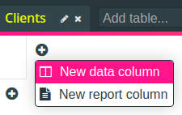

# Building Your First Herculus App

In this guide we are going to create a simple Herculus application. We will
assume that you are working as a freelancer and that you want to have a tool
that

* tracks how many hours you worked for which client, and
* allows you to create a PDF invoice that you can send to your clients at the
  end of the month.

By building such a tool with Herculus, you will learn how to

* organize your data into different tables,
* create relations between them,
* process your data to generate new data using formulas, and how to
* generate reports from your data.

## Create a new Project

After logging in, the first thing we are going to do is create a new project
(call it, for example, _Freelancing_).

Enter the name on the _Create new..._ card and press `Enter`. This will create
the project and bring you to the _Project_ page.

## The First Table

A project consists of several tables which are filled with your data. Since our
project was just created, there are no tables yet. Let's create one. Focus the
_Add table..._ input field, and enter the name:

Our first table will be the collection of clients that we work for, so we will
call it _Clients_. After you press enter, the newly created table will be
created and opened. Naturally, every table consists of _columns_ and _rows_. We
can add rows or columns by pressing the bottom left or top right plus icons,
respectively. In our case,

* each row will correspond to one of our clients
* each column will correspond to an attribute that a client has.

## Adding Columns

Let's first create a couple of columns for every attribute that we might
need. Press to top right plus icon and select _New data column_:

Don't worry about what a _report column_ is, we'll get to that later.

Every column has a _name_ and a _type_. The type is the kind of things that all
the cells in this column contain. For example, since all our clients have a
name, we'll give the first column the name _Name_, and since client names are
strings, we'll give the first column the type `String`.

The name of the column can be easily changed by clicking on the gray "Name..."
placeholder, entering the name and then pressing `Enter`. In order to change the
column's type, click on the gear symbol next to the column name:

The popup dialog shows two things: On the left, you can choose the
column type from a dropdown menu, and on the right, you can edit the formula
that is used to compute the data in this column (more on that later). So, choose
`String` from the dropdown menu, and click _Save_.

For our clients we want to have a second column for their address, which also
has the type `String`. After you have added the second column, the table should
look like this:

## Adding Rows
